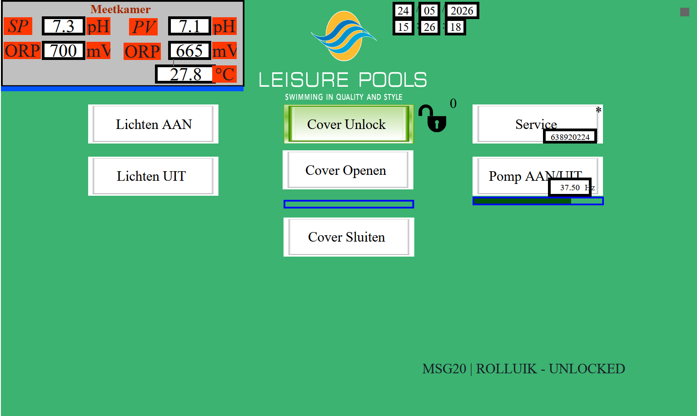

# Leisure Pools


[](https://github.com/hacs/integration)

Home Assistant integration for **Leisure Pools** pool controllers built on the
**eSmart107** HMI platform. Talks directly to the controller over the local
network — no cloud, no broker, no extra services.



## Features

- Pool light on/off plus a "next colour" button
- Pool cover open / close / stop, with state and lock switch
- Pump mode selector: `auto`, `uit`, `speed 1-3`, `vacuum`, `backwash`, `rinse`
- Water sensors: pH, chlorine (Cl), temperatures
- Alarm and status banners as binary sensors
- Live updates over the controller's Server-Sent Events stream (`local_push`)

## Installation

### HACS

1. In Home Assistant, open **HACS → Integrations**.
2. Add this repository as a custom repository (category: Integration), or
   search for **Leisure Pools** if it's already in your HACS index.
3. Click **Download**.
4. Restart Home Assistant.
5. Go to **Settings → Devices & Services → + Add Integration** and pick
   **Leisure Pools**.

### Manual

1. Copy `custom_components/leisure_pools/` into your Home Assistant
   `config/custom_components/` directory.
2. Restart Home Assistant.
3. **Settings → Devices & Services → + Add Integration → Leisure Pools**.

## Configuration

During setup you provide:

| Field    | Description                                      | Default |
|----------|--------------------------------------------------|---------|
| Host     | IP or hostname of the controller (e.g. `192.168.20.3`) | —     |
| Username | Controller username                              | `admin` |
| Password | Controller password                              | `admin` |

## Lovelace dashboard

A starter dashboard card (alarms grid plus controls) is in
[lovelace/leisure-pool-card.yaml](lovelace/leisure-pool-card.yaml). Copy it
into a dashboard view and tweak entity IDs as needed.

## Repository layout

```
.
├── custom_components/leisure_pools/   Home Assistant integration
├── lovelace/                          Example Lovelace card YAML
├── docs/
│   ├── images/                        Screenshots used in the README
│   └── reference/
│       ├── api-samples/               Captured SSE / alarm / message JSON
│       └── controller-project/        Original eSmart107 HMI project bundle
└── tools/                             Dev probes (SSE sniffer, page dumper)
```

The `docs/reference/` folder is reverse-engineering material — not needed at
runtime, but useful when adding new entities or debugging the controller.

## Development

The integration is a thin client on top of the controller's HTTP + SSE API.
See [tools/README.md](tools/README.md) for the SSE probe used to capture live
tag streams; sample captures are in
[docs/reference/api-samples/](docs/reference/api-samples/).

Issues and PRs: <https://github.com/stijn220/leisure-pools/issues>
